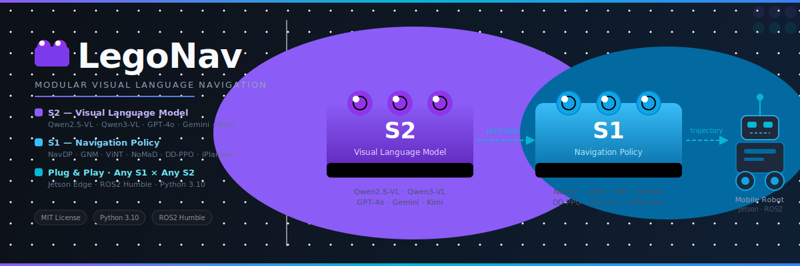
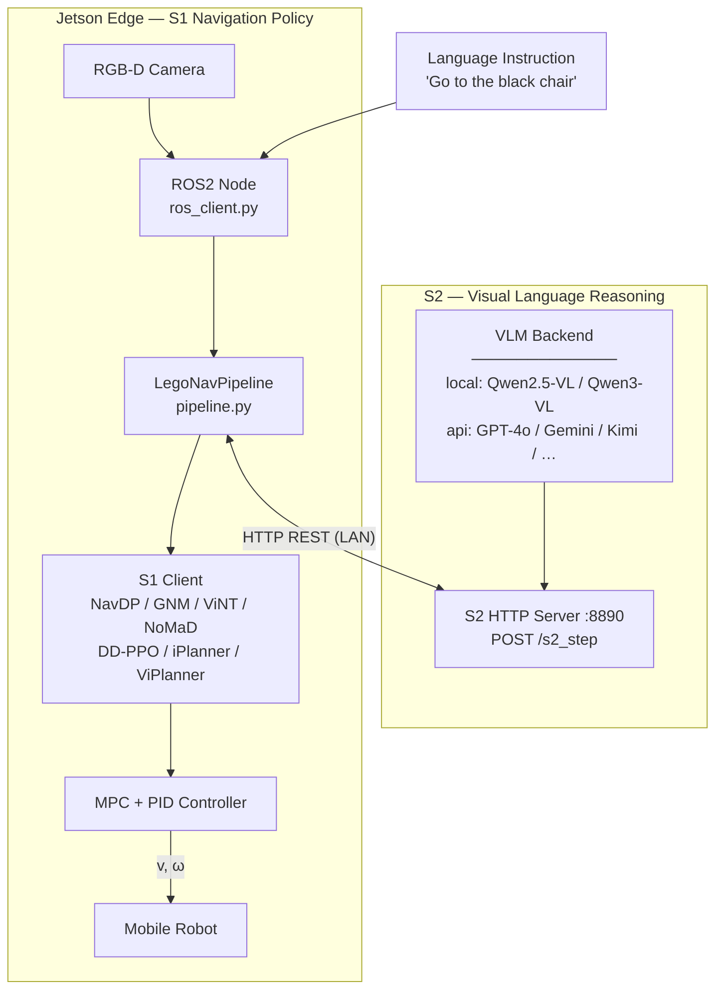
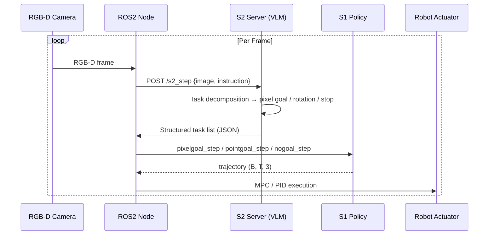
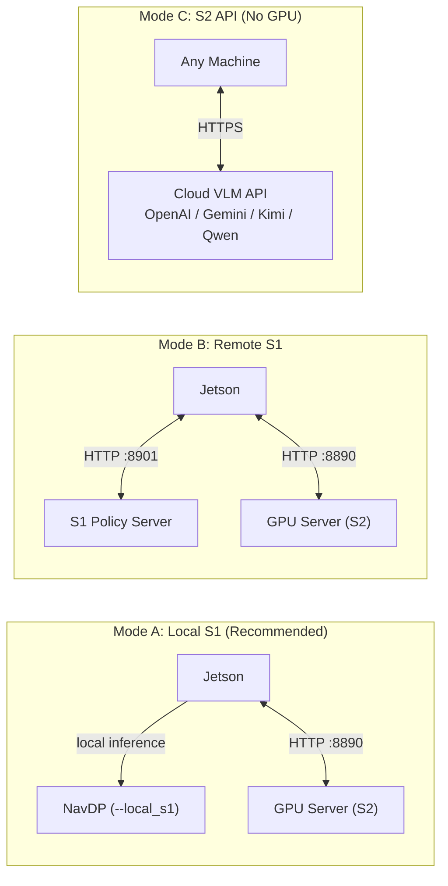

# LegoNav

<p align="center">
  
</p>

**LegoNav** is a modular visual language navigation framework — designed like **Lego bricks**: each module (S1, S2) is independently replaceable and freely composable.

- **S2** (High-level reasoning): any vision-language model — local GPU or cloud API
- **S1** (Low-level motion control): any navigation policy — NavDP, GNM, ViNT, NoMaD, DD-PPO, iPlanner, ViPlanner, …

Plug in any combination, run on Jetson edge hardware.

---

## System Architecture



### Navigation Loop



### Deployment Modes



---

## Project Structure

```
LegoNav/
├── legonav/
│   ├── server/
│   │   └── s2_server.py              # S2: VLM HTTP server (port 8890)
│   │                                 #   --backend local | api
│   │                                 #   --provider openai | gemini | kimi | qwen | custom
│   ├── clients/
│   │   ├── base_client.py            # S1 abstract base class (BaseS1Client)
│   │   ├── navdp_client.py           # NavDP HTTP client
│   │   ├── navdp_local_client.py     # NavDP local inference (Jetson)
│   │   ├── gnm_client.py             # GNM HTTP client
│   │   ├── vint_client.py            # ViNT HTTP client
│   │   ├── nomad_client.py           # NoMaD HTTP client
│   │   ├── ddppo_client.py           # DD-PPO HTTP client
│   │   ├── iplanner_client.py        # iPlanner HTTP client
│   │   └── viplanner_client.py       # ViPlanner HTTP client
│   ├── core/
│   │   ├── pipeline.py               # S2+S1 orchestration (LegoNavPipeline)
│   │   └── navdp_agent.py            # NavDP_Policy wrapper
│   ├── robot/
│   │   ├── ros_client.py             # Jetson ROS2 node
│   │   └── controllers.py            # MPC + PID controllers (CasADi)
│   └── utils/
│       └── thread_utils.py
├── tests/
│   └── test_s2_client.py
├── scripts/
│   ├── start_s2_server.sh
│   └── start_jetson.sh
├── setup.py
├── requirements_server.txt           # GPU server / API mode dependencies
└── requirements_jetson.txt           # Jetson edge dependencies
```

---

## S2 — Visual Language Model

### Supported Backends

| Mode | `--backend` | Description |
|------|-------------|-------------|
| Local GPU | `local` | Load model weights on your GPU |
| Cloud API | `api` | Call external VLM via OpenAI-compatible API |

### Supported Models

**Local (`--backend local`)**

| Model | `--model_path` | VRAM |
|-------|----------------|------|
| Qwen2.5-VL-7B *(default)* | `Qwen/Qwen2.5-VL-7B-Instruct` | ~16 GB |
| Qwen2.5-VL-72B | `Qwen/Qwen2.5-VL-72B-Instruct` | ~144 GB |
| Qwen3-VL-8B | `Qwen/Qwen3-VL-8B-Instruct` | ~16 GB |
| Qwen2-VL-7B | `Qwen/Qwen2-VL-7B-Instruct` | ~16 GB |

**API (`--backend api`)**

| Provider | `--provider` | Example models | API Key env var |
|----------|-------------|----------------|-----------------|
| OpenAI | `openai` | `gpt-4o`, `gpt-4.1` | `OPENAI_API_KEY` |
| Google | `gemini` | `gemini-2.5-pro`, `gemini-2.0-flash` | `GEMINI_API_KEY` |
| Moonshot (Kimi) | `kimi` | `moonshot-v1-vision` | `MOONSHOT_API_KEY` |
| DashScope (Qwen) | `qwen` | `qwen-vl-max`, `qwen2.5-vl-72b-instruct` | `DASHSCOPE_API_KEY` |
| Custom | `custom` | any | `API_KEY` |

### S2 Launch Examples

```bash
# Local — Qwen2.5-VL-7B (default)
python -m legonav.server.s2_server --model_path Qwen/Qwen2.5-VL-7B-Instruct

# Local — Qwen3-VL-8B (latest)
python -m legonav.server.s2_server --model_path Qwen/Qwen3-VL-8B-Instruct

# API — OpenAI GPT-4o
OPENAI_API_KEY=sk-xxx python -m legonav.server.s2_server \
    --backend api --provider openai --model_path gpt-4o

# API — Gemini 2.5 Pro
GEMINI_API_KEY=AIzaSy-xxx python -m legonav.server.s2_server \
    --backend api --provider gemini --model_path gemini-2.5-pro

# API — Kimi VL
MOONSHOT_API_KEY=sk-xxx python -m legonav.server.s2_server \
    --backend api --provider kimi --model_path moonshot-v1-vision

# API — Qwen-VL-Max (DashScope)
DASHSCOPE_API_KEY=sk-xxx python -m legonav.server.s2_server \
    --backend api --provider qwen --model_path qwen-vl-max

# API — Custom OpenAI-compatible endpoint (e.g. Ollama)
python -m legonav.server.s2_server \
    --backend api --provider custom \
    --api_base_url http://localhost:11434/v1 \
    --model_path llava:13b --api_key none
```

---

## S1 — Navigation Policy

All S1 clients inherit `BaseS1Client` and expose the same interface:

```python
client.reset(camera_intrinsic, batch_size=1, stop_threshold=-3.0)
traj, all_traj, values = client.pixelgoal_step(pixel_goals, rgb_images, depth_images)
traj, all_traj, values = client.pointgoal_step(point_goals, rgb_images, depth_images)
traj, all_traj, values = client.imagegoal_step(goal_images, rgb_images, depth_images)
traj, all_traj, values = client.nogoal_step(rgb_images, depth_images)
```

### Supported Policies

| Client | Paper / Source | pixelgoal | pointgoal | imagegoal | nogoal | Stop mechanism | Default port |
|--------|---------------|:---------:|:---------:|:---------:|:------:|----------------|:---:|
| `NavDPClient` | [NavDP](https://github.com/InternRobotics/NavDP) (InternRobotics) | ✅ | ✅ | ✅ | ✅ | Learned Critic | 8901 |
| `NavDPLocalClient` | NavDP, local inference | ✅ | ✅ | ✅ | ✅ | Learned Critic | — |
| `GNMClient` | [GNM](https://github.com/robodhruv/visualnav-transformer) (Berkeley, ICRA 2023) | ⬇️ | ⬇️ | ✅ | ✅ | Distance threshold | 8047 |
| `ViNTClient` | [ViNT](https://github.com/robodhruv/visualnav-transformer) (Berkeley, CoRL 2023) | ⬇️ | ⬇️ | ✅ | ✅ | Distance threshold | 8047 |
| `NoMaDClient` | [NoMaD](https://github.com/robodhruv/visualnav-transformer) (Berkeley, ICRA 2024) | ⬇️ | ⬇️ | ✅ | ✅ | Distance threshold | 8048 |
| `DDPPOClient` | [DD-PPO](https://github.com/facebookresearch/habitat-lab) (Meta, ICLR 2020) | ✅ | ✅ | ⬇️ | ✅ | action=STOP | 8902 |
| `iPlannerClient` | [iPlanner](https://github.com/ZhuangYanDLUT/iPlanner) (RSS 2023) | ✅ | ✅ | ⬇️ | ✅ | Distance threshold | 8903 |
| `ViPlannerClient` | [ViPlanner](https://github.com/leggedrobotics/viplanner) (ETH, ICRA 2024) | ✅ | ✅ | ⬇️ | ✅ | Distance threshold | 8904 |

> ⬇️ = falls back to `nogoal` mode (model does not natively support this goal type)

### Stop Threshold by Policy

| Policy | `stop_threshold` | Notes |
|--------|-----------------|-------|
| NavDP | `-3.0` *(default)* | Negative = Critic score; lower = stricter |
| GNM / ViNT / NoMaD / iPlanner / ViPlanner | `-99` | Disable Critic-based stop; use `stop_dist` in client |
| DD-PPO | `-99` | Stopped when model outputs action=STOP |

### S1 Usage in Pipeline

```python
from legonav.core.pipeline import LegoNavPipeline
from legonav.clients import (
    NavDPClient, NavDPLocalClient,
    GNMClient, ViNTClient, NoMaDClient,
    DDPPOClient, iPlannerClient, ViPlannerClient,
)

# NavDP local (recommended for Jetson)
pipeline = LegoNavPipeline(
    s2_host="192.168.1.100",
    s1_client=NavDPLocalClient(
        checkpoint="/path/to/navdp.ckpt",
        device="cuda:0",
        half=True,
    ),
)

# GNM remote server
pipeline = LegoNavPipeline(
    s2_host="192.168.1.100",
    s1_client=GNMClient(host="192.168.1.101", port=8047),
)

# GPT-4o as S2 + ViNT as S1
pipeline = LegoNavPipeline(
    s2_url="http://gpu-server:8890/s2_step",
    s1_client=ViNTClient(host="nav-server", port=8047, stop_dist=0.4),
)

pipeline.reset("Go to the black chair", stop_threshold=-99)
result = pipeline.step(rgb_bgr, depth_m)
```

---

## Installation

### S2 Server (GPU machine)

```bash
conda create -n legonav_s2 python=3.10
conda activate legonav_s2

# PyTorch (adjust for your CUDA version)
pip install torch torchvision --index-url https://download.pytorch.org/whl/cu121

# LegoNav S2 dependencies
cd /path/to/LegoNav
pip install -r requirements_server.txt

# Optional: Flash Attention
pip install flash-attn --no-build-isolation

# Optional: API mode (already included in requirements_server.txt)
pip install openai
```

**Model download (local mode):**

```bash
# Qwen2.5-VL-7B (recommended)
huggingface-cli download Qwen/Qwen2.5-VL-7B-Instruct \
    --local-dir /path/to/Qwen2.5-VL-7B-Instruct

# Qwen3-VL-8B (latest)
huggingface-cli download Qwen/Qwen3-VL-8B-Instruct \
    --local-dir /path/to/Qwen3-VL-8B-Instruct
```

### S1 Edge (Jetson running NavDP)

```bash
conda create -n legonav_s1 python=3.10
conda activate legonav_s1

# Clone NavDP as a sibling of LegoNav
cd ~/VLN
git clone https://github.com/InternRobotics/NavDP

# Jetson PyTorch (prebuilt aarch64 wheel)
pip install /path/to/torchvision-0.21.0-cp310-cp310-linux_aarch64.whl

# NavDP dependencies
cd ~/VLN/NavDP/baselines/navdp
pip install -r requirements.txt

# LegoNav Jetson dependencies
cd ~/VLN/LegoNav
pip install -r requirements_jetson.txt

# ROS2 packages
sudo apt install ros-humble-cv-bridge ros-humble-message-filters
```

> **NavDP path resolution:** `navdp_agent.py` looks for `NavDP/` as a sibling of `LegoNav/`.
> Override with: `export NAVDP_ROOT=/path/to/NavDP`

---

## Quick Start

### 1. Start S2 server

```bash
conda activate legonav_s2

# Local GPU
python -m legonav.server.s2_server \
    --model_path /path/to/Qwen2.5-VL-7B-Instruct \
    --port 8890

# Or cloud API (no GPU needed)
OPENAI_API_KEY=sk-xxx python -m legonav.server.s2_server \
    --backend api --provider openai --model_path gpt-4o --port 8890
```

### 2. Test S2 connectivity

```bash
python tests/test_s2_client.py \
    --host 127.0.0.1 --port 8890 \
    --random --instruction "Go to the chair"
```

### 3. Pipeline test (S2 only)

```bash
python -m legonav.core.pipeline \
    --s2_host 127.0.0.1 --s2_port 8890 \
    --random --skip_s1 \
    --instruction "Turn left, go to the door"
```

### 4. Full Jetson deployment (ROS2 + local NavDP)

> **Prerequisites:** Start robot chassis and camera drivers first:
> ```bash
> # Terminal 1 — robot base
> ros2 launch wheeltec_robot base_node.launch.py
>
> # Terminal 2 — RGB-D camera
> ros2 launch orbbec_camera gemini_336l.launch.py
> ```

```bash
conda activate legonav_s1

python -m legonav.robot.ros_client \
    --instruction "Go to the black chair" \
    --s2_host 192.168.1.100 \
    --local_s1 \
    --s1_checkpoint /path/to/navdp.ckpt \
    --s1_half
```

### 5. Jetson with remote S1 server

```bash
python -m legonav.robot.ros_client \
    --instruction "Go to the red chair" \
    --s2_host 192.168.1.100 \
    --s1_host 192.168.1.100 --s1_port 8901
```

---

## Camera Intrinsics

| Camera | Resolution | Constant |
|--------|------------|----------|
| Gemini 336L *(default)* | 1280×720 | `GEMINI_336L_INTRINSIC` |
| Astra S | 640×480 | `ASTRA_S_INTRINSIC` |

Switch camera:
```bash
python -m legonav.server.s2_server \
    --model_path /path/to/model \
    --image_width 640 --image_height 480 \
    --resize_w 640 --resize_h 480
```

---

## Acknowledgements

**S2 Models**
- [QwenLM/Qwen2.5-VL](https://github.com/QwenLM/Qwen2.5-VL) / [Qwen3-VL](https://github.com/QwenLM/Qwen3-VL)
- [OpenAI GPT-4o](https://platform.openai.com/docs/models/gpt-4o)
- [Google Gemini](https://ai.google.dev/)
- [Moonshot Kimi](https://platform.moonshot.cn/)

**S1 Policies**
- [InternRobotics/NavDP](https://github.com/InternRobotics/NavDP) — Navigation Diffusion Policy
- [robodhruv/visualnav-transformer](https://github.com/robodhruv/visualnav-transformer) — GNM / ViNT / NoMaD
- [facebookresearch/habitat-lab](https://github.com/facebookresearch/habitat-lab) — DD-PPO
- [ZhuangYanDLUT/iPlanner](https://github.com/ZhuangYanDLUT/iPlanner) — iPlanner
- [leggedrobotics/viplanner](https://github.com/leggedrobotics/viplanner) — ViPlanner
