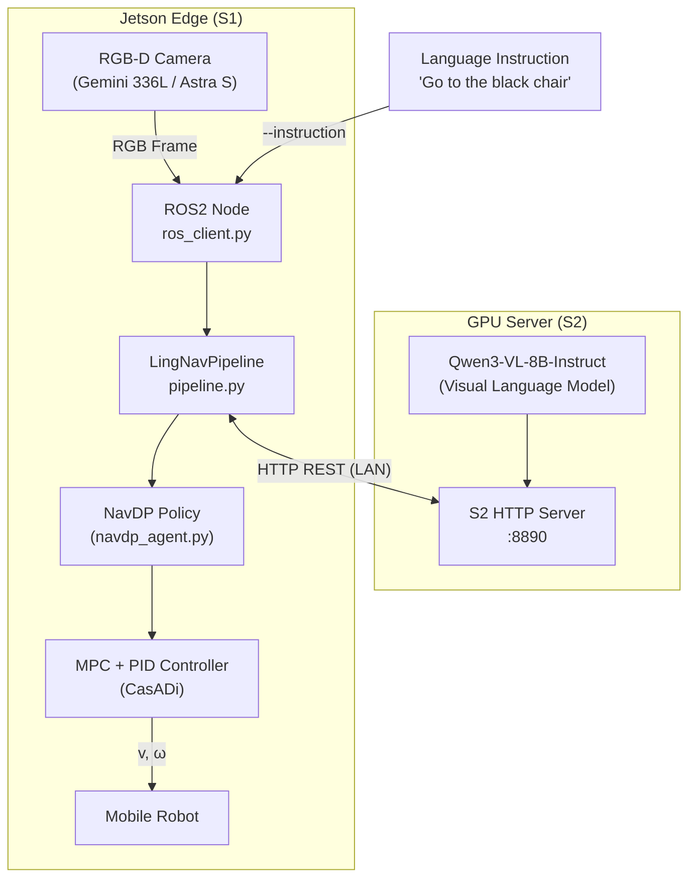
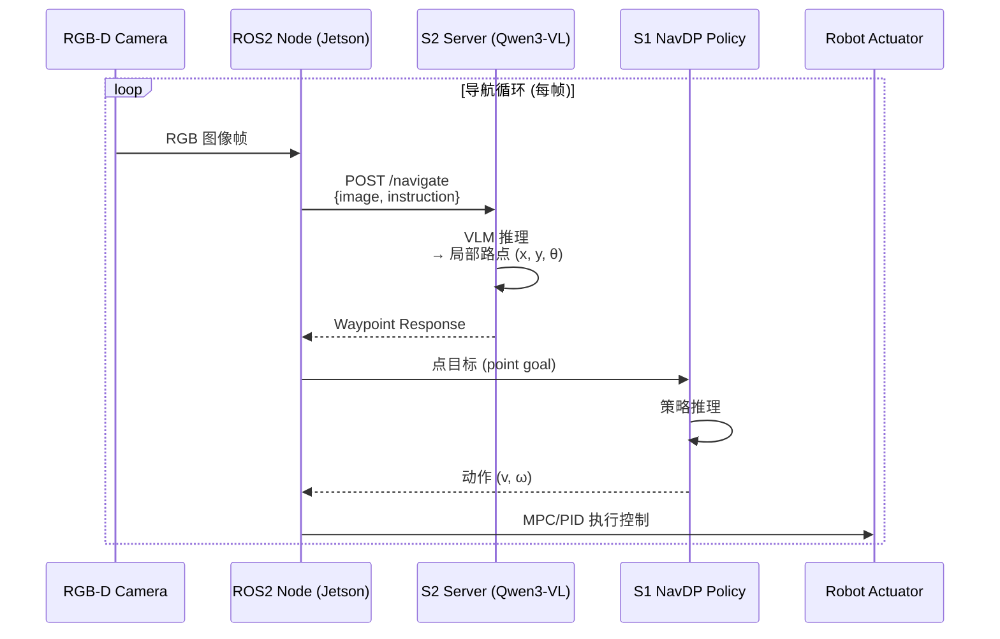
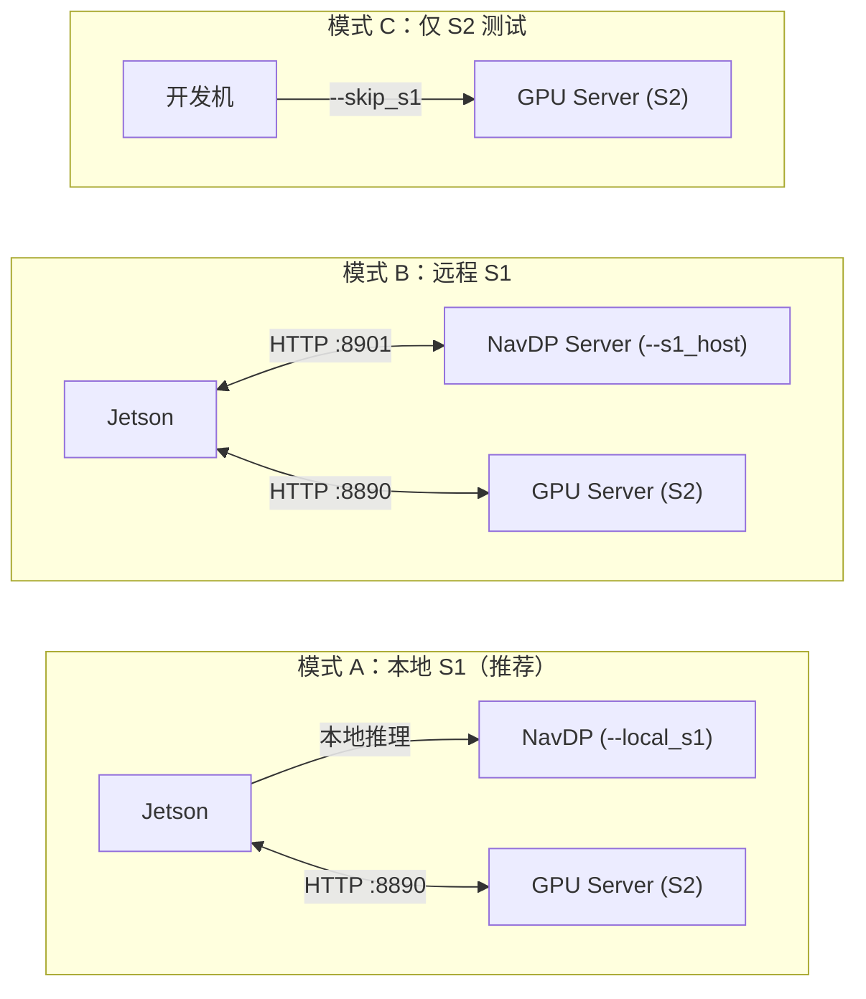

# LingNav

**LingNav** is a dual-system visual language navigation framework combining **Qwen3-VL (S2)** for language-grounded waypoint reasoning and **NavDP (S1)** for low-level motion control — designed for real-world robot deployment on Jetson edge hardware.

LingNav 独立部署框架：基于 Qwen3-VL（S2 语言推理）+ NavDP（S1 运动控制）的双系统室内导航方案。

---

## 系统架构



### 数据流时序



### 部署模式



---

## 项目结构

```
LingNav/
├── lingnav/                        # Python 包（pip install -e . 安装）
│   ├── server/
│   │   └── s2_server.py           # S2：Qwen3-VL HTTP 服务器（端口 8890）
│   ├── clients/
│   │   ├── navdp_client.py        # HTTP S1 客户端
│   │   └── navdp_local_client.py  # 本地 S1 推理（可替换 HTTP 客户端）
│   ├── core/
│   │   ├── pipeline.py            # S2+S1 协调调度（LingNavPipeline 类）
│   │   └── navdp_agent.py         # NavDP_Policy 封装
│   ├── robot/
│   │   ├── ros_client.py          # Jetson ROS2 节点（规划线程 + 控制线程）
│   │   └── controllers.py         # MPC + PID 控制器（CasADi）
│   └── utils/
│       └── thread_utils.py        # 读写锁（ReadWriteLock）
├── tests/
│   └── test_s2_client.py          # S2 独立测试客户端
├── scripts/
│   ├── start_s2_server.sh         # GPU 服务器启动脚本
│   └── start_jetson.sh            # Jetson 端启动脚本
├── setup.py
├── requirements_server.txt        # GPU 服务器依赖
└── requirements_jetson.txt        # Jetson 边缘端依赖
```

**NavDP 依赖**：`navdp_agent.py` 默认从 LingNav **上一级目录**的 `NavDP/` 加载 `NavDP_Policy`（来自 [InternRobotics/NavDP](https://github.com/InternRobotics/NavDP)）。
例如 LingNav 在 `~/VLN/LingNav`，则 NavDP 应在 `~/VLN/NavDP`。
可通过环境变量覆盖：`NAVDP_ROOT=/path/to/NavDP`。

---

## 环境安装

### S2 服务器环境（GPU 机器，运行 Qwen3-VL）

参考：[QwenLM/Qwen3-VL](https://github.com/QwenLM/Qwen3-VL)

```bash
conda create -n qwen3vl python=3.10
conda activate qwen3vl

# clone Qwen3-VL（获取工具脚本）
git clone https://github.com/QwenLM/Qwen3-VL
cd Qwen3-VL

# 安装 PyTorch（根据 CUDA 版本选择，示例为 CUDA 12.1）
pip install torch torchvision --index-url https://download.pytorch.org/whl/cu121

# 安装 LingNav S2 依赖
cd /path/to/LingNav
pip install -r requirements_server.txt

# 可选：Flash Attention 加速推理
pip install flash-attn --no-build-isolation

# 下载模型权重（Hugging Face）
huggingface-cli download Qwen/Qwen3-VL-8B-Instruct --local-dir /path/to/Qwen3-VL-8B-Instruct
# 或使用 ModelScope（国内推荐）
# modelscope download --model Qwen/Qwen3-VL-8B-Instruct --local_dir /path/to/Qwen3-VL-8B-Instruct
```

### Jetson 边缘端环境（运行 NavDP S1）

参考：[InternRobotics/NavDP](https://github.com/InternRobotics/NavDP)

```bash
conda create -n navdp python=3.10
conda activate navdp

# clone NavDP（与 LingNav 同级目录）
cd ~/VLN
git clone https://github.com/InternRobotics/NavDP

# 安装 Jetson 专用 PyTorch / Torchvision（预编译 aarch64 wheel）
pip install /home/wheeltec/torchvision-0.21.0-cp310-cp310-linux_aarch64.whl

# 安装 NavDP 模型依赖
cd ~/VLN/NavDP/baselines/navdp
pip install -r requirements.txt

# 安装 LingNav Jetson 依赖
cd ~/VLN/LingNav
pip install -r requirements_jetson.txt

# ROS2 相关（apt 安装）
sudo apt install ros-humble-cv-bridge ros-humble-message-filters
```

---

## 快速开始

### 1. 启动 S2 服务器（GPU 机器）

```bash
conda activate qwen3vl

python -m lingnav.server.s2_server \
    --model_path /path/to/Qwen3-VL-8B-Instruct \
    --port 8890
```

### 2. 测试 S2 连通性

```bash
conda activate qwen3vl

# 随机图像（连通性测试）
python tests/test_s2_client.py --host 127.0.0.1 --port 8890 \
    --random --instruction "Go to the chair"

# 真实图像
python tests/test_s2_client.py --host 127.0.0.1 --port 8890 \
    --image /path/to/test.jpg --instruction "Go to the door"
```

### 3. Pipeline 测试（仅 S2，跳过 S1）

```bash
conda activate qwen3vl

python -m lingnav.core.pipeline \
    --s2_host 127.0.0.1 --s2_port 8890 \
    --random --skip_s1 \
    --instruction "Turn left, go to the door"
```

### 4. Jetson 完整部署（ROS2 + 本地 S1）

```bash
conda activate navdp

cd ~/VLN/LingNav
# NavDP 默认从上一级目录的 NavDP/ 加载，无需 NAVDP_ROOT
python -m lingnav.robot.ros_client \
    --instruction "Go to the black chair" \
    --s2_host 192.168.1.100 \
    --local_s1 \
    --s1_checkpoint /home/wheeltec/VLN/checkpoints/navdp-cross-modal.ckpt \
    --s1_half
```

### 5. Jetson 使用远程 S1 服务器

```bash
conda activate navdp

python -m lingnav.robot.ros_client \
    --instruction "Go to the red chair" \
    --s2_host 192.168.1.100 \
    --s1_host 192.168.1.100 --s1_port 8901
```

### 6. NavDP 本地导入测试

```bash
conda activate navdp

python -c "from lingnav.clients.navdp_local_client import NavDPLocalClient; print('OK')"
```

---

## 相机内参

| 相机 | 分辨率 | 常量名 |
|------|--------|--------|
| Gemini 336L（默认） | 1280×720 | `GEMINI_336L_INTRINSIC` |
| Astra S | 640×480 | `ASTRA_S_INTRINSIC` |

切换相机（S2 服务器）：
```bash
python -m lingnav.server.s2_server \
    --model_path /path/to/model \
    --image_width 640 --image_height 480 \
    --resize_w 640 --resize_h 480
```

---

## 致谢

- [QwenLM/Qwen3-VL](https://github.com/QwenLM/Qwen3-VL) — S2 视觉语言模型
- [InternRobotics/NavDP](https://github.com/InternRobotics/NavDP) — S1 导航策略
